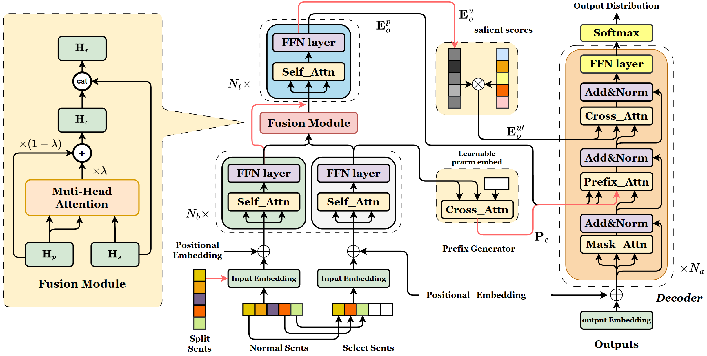

# Salience-aware Dialogue Summarization via Parallel Original-Extracted Streams

## Intro

In dialogue summarization, traditional approaches often concatenate utterances in a linear fashion, overlooking the dispersion of actions and intentions inherent in interactive conversations. This tendency frequently results in inaccurate summary generation. In response to this challenge, we formulate dialogue summarization as an extract-then-generate task. To tackle the extraction phase, we introduce an algorithm designed to identify **U**tterances **M**ost related to speakers' key **I**ntents (UMIs). These UMIs serve as labels to train an extraction model. Moving to the generation phase, we view a dialogue as parallel original-extracted streams. Correspondingly, we present a model named **R**ow-**C**olumn Fusion Dual-Encoders and **U**tterance **P**refix for Dialogue **S**ummarization, abbreviated as RCUPS, with the goal of enhancing the model's ability to discern utterances and align with our sentence-level extraction. RCUPS integrates the row-column wise fusion module, which amalgamates vector representations from a dual-branch encoder. In the decoding stage, an utterance-level prefix is strategically employed to emphasize crucial details, while weight decay is applied to non-UMIs to mitigate their influence. To assess the effectiveness of RCUPS, extensive experiments on SAMSum, DialogSum, and TODSum datasets show significant improvements over robust baselines.



## Setup

**File Structure**

```
├── README.md
├── data
│   ├── TODsum
│   │   ├── final_test.json
│   │   ├── final_train.json
│   │   └── final_validation.json
│   ├── dialogsum
│   │   ├── final_test.json
│   │   ├── final_train.json
│   │   └── final_validation.json
│   └── samsum
│       ├── final_test.json
│       ├── final_train.json
│       └── final_validation.json
├── llm_eval
│   ├── comment_llm.py
│   └── gene_llm.py
├── readme_resources
│   ├── env.yaml
│   └── modelstructure.png
└── src
    ├── _transformers
    │   ├── data_collator.py
    │   ├── seq2seq_trainer.py
    │   └── training_args_seq2seq.py
    ├── config
    │   └── RCUPSconfig.json
    ├── extraction.py
    ├── model
    │   ├── RCUPSconf.py
    │   └── bart_model.py
    ├── run.sh
    ├── run_summarization.py
    └── utils
        ├── __init__.py
        ├── args_util.py
        ├── data_util.py
        ├── metrics_util.py
        └── model_util.py
```

Our env details are show in [env_config](./readme_resources/env.yaml)

```python
## firstly install torch corresponding to the CUDA
# main package
pip install transformers==4.8.2 \
	py-rouge nltk numpy datasets
```

## Data

All the data are open source.

|                |                            SAMsum                            |                        Dialogsum                        |                        TODsum                         |
| :------------: | :----------------------------------------------------------: | :-----------------------------------------------------: | :---------------------------------------------------: |
|    raw data    | [Samsung/samsum · Datasets at Hugging Face](https://huggingface.co/datasets/Samsung/samsum) | [cylnlp/dialogsum](https://github.com/cylnlp/DialogSum) | [pris-nlp/TODSum](https://github.com/pris-nlp/TODSum) |
| processed data |                 [data/SAMsum](./data/samsum)                 |           [data/Dialogsum](./data/dialogsum)            |             [data/TODsum](./data/TODsum)              |

We use the [bertsum](https://github.com/nlpyang/BertSum) for utterances extraction.

## Fine tuning

1. Change the pretrain model ckpt path in [src/config/RCUPSconfig.json](./src/config/RCUPSconfig.json)
2. Use the shell script [run.sh](./src/run.sh)

## LLM evaluation

1. LLM generation script: [llm_eval/gene_llm.py](./llm_eval/gene_llm.py). This script only accepts JSON files.

   ```bash
   # json file with examples in a format : {"idxn": text} (n is the order of the sample)
   python gene_llm.py our_dir api_url json_file
   ```

2. LLM scores script: [llm_eval/comment_llm.py](./llm_eval/comment_llm.py)

   ```bash
   # txt file with a sample in a line:
   python comment_llm.py out_file_name.json, api_url, target_file.txt txt
   # json file with examples in a format : {"idxn": text} (n is the order of the sample)
   python comment_llm.py out_file_name.json, api_url, target_file.json json
   # comment on labels which was a json file in a format: {"summary": text}
   python comment_llm.py out_file_name.json, api_url, target_file.json summ
   ```

3. Summaries generated by DeepSeek：[result](./llm_eval/ds_summary.txt)

***

Some of the code we used is borrowed from [SDDS](https://github.com/Hannibal046/SDDS)